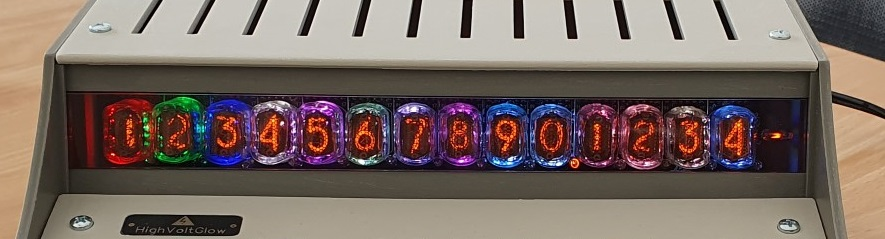

# 14-digit nixie calculator
## This repository contains some information and ideas for building a nixie calculator.

## WARNING: nixies need high voltage to light up. If you choose to build or use the calculator, you are doing so at your own risk.
#### Notes:
- **This repository does not contain a complete project design. The design of the high voltage power supply (170V / ≥45mA) is not provided.**
- **Be aware that I'm just an electronics hobbyist and nixie enthusiast. However, this repository is only intended for suitable qualified electronics engineers who are familiar with nixie tubes.**
- **Please read all documents in [Docs](Docs) before deciding whether to build the calculator.**
- **I'm not affiliated with any of the service providers named in this project.**
#### Status: 
- Software: coming soon
- Hardware: ready to be reviewed

**Features:**
-	4 versions: IN-12, IN-16, IN-17 and B-5870
-	14 digits with decimal points and minus sign
-	easy nixie replacement
- LED backlighting/underlighting
-	mechanical keyboard with 35 switches
-	custom keycap legends and colors
-	15 math operations - the functionality can be extended by adding a second level of functions
-	5 memory operations
-	RTC with battery
-	clock mode
-	stopwatch mode 
-	ESP32 based controller board
-	PIR, GPS and temperature sensor module
-	12V DC input voltage
-	no network connection is needed (all the settings are adjusted using the keyboard)
-	3D printed case
-	open-source firmware
#### IN-12 version

#### IN-16 version

#### B-5870 version

#### IN-17 version

#### All versions have RGB lighting

